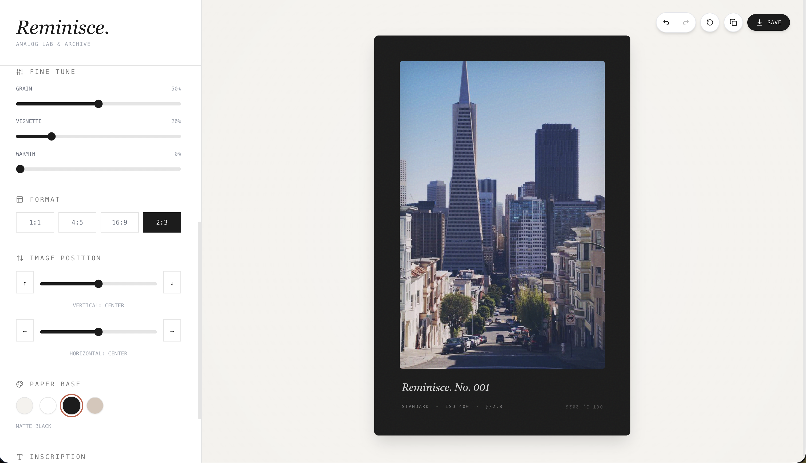

<p align="center">
  
</p>

<div align="center">
  <h1>Reminisce.</h1>
  <p><em>Analog Lab & Archive</em></p>
  <p>Transform your photos into beautiful analog film-style prints with customizable film stocks, paper types, and typography.</p>

  <p>
    <a href="https://reminisce-brown.vercel.app/">
      
    </a>
    <a href="https://github.com/harry0x/reminisce">
      
    </a>
  </p>

  <p>
    <a href="https://github.com/harry0x/reminisce/actions/workflows/ci.yml"></a>
    <a href="LICENSE"></a>
    <a href="CONTRIBUTING.md"></a>
  </p>

  <p>🌐 <strong>Live:</strong> <a href="https://reminisce-brown.vercel.app/">reminisce-brown.vercel.app</a></p>
</div>

---

## 🎬 Video Tutorial

Watch a full walkthrough of Reminisce — uploading a photo, picking a film stock, fine-tuning effects, framing, and exporting your print.

<p align="center">
  <a href="https://res.cloudinary.com/tonojvru/video/upload/v1791050480/reminisce-tutorial.mp4">
    
  </a>
</p>

<p align="center">▶️ <strong><a href="https://res.cloudinary.com/tonojvru/video/upload/v1791050480/reminisce-tutorial.mp4">Click to watch the full tutorial</a></strong></p>

---

## 📸 About

**Reminisce.** is a web application that transforms digital photos into beautiful analog film-style photo cards. It offers a curated selection of film stocks, paper textures, aspect ratios, and typography options to create stunning, gallery-ready prints.

### ✨ Features

#### 🎞️ Film & Effects

- **Film Stock Presets** - Choose from multiple film emulations (Portra 400, Ilford HP5, Cinestill 800T, Ektar 100, and more)
- **Granular Controls** - Fine-tune Grain, Vignette, and Warmth with precise sliders
- **Real-time Preview** - See your changes instantly as you customize

#### 🖼️ Frame Styles

- **Standard** - Clean gallery-style presentation
- **Film Strip** - Authentic 35mm film look with sprocket holes (auto-orientation)
- **Polaroid** - Classic instant-film aesthetic with signature chin

#### 📄 Paper & Typography

- **Paper Types** - Select from different paper bases (Alabaster, Exhibition White, Matte Black, Kraft)
- **Custom Typography** - Add captions with different font styles (Serif, Script, Mono)
- **Aspect Ratios** - Multiple formats including 1:1, 4:5, 16:9, and 2:3
- **Image Position** - Reframe your photo inside the print with vertical and horizontal sliders (plus step buttons)

#### 🚀 Productivity

- **Undo/Redo** - Full history with `Ctrl+Z` / `Ctrl+Shift+Z` support
- **Copy to Clipboard** - One-click copy for quick social sharing
- **Reset All** - Instantly restore default settings
- **EXIF Extraction** - Auto-reads camera metadata from uploaded images

#### 📱 Export & Responsive

- **High-Res Export** - Download 2x resolution PNG exports
- **Fully Responsive** - Optimized for both mobile and desktop
- **Drag & Drop** - Easy image upload

## 🚀 Getting Started

### Installation

1. **Clone the repository**

   ```bash
   git clone https://github.com/harry0x/reminisce.git
   cd reminisce
   ```

2. **Install dependencies**

   ```bash
   npm install
   ```

3. **Start the development server**

   ```bash
   npm run dev
   ```

4. **Open your browser**
   Navigate to `http://localhost:3000` (or the port shown in your terminal)

## 📦 Building for Production

To create a production build:

```bash
npm run build
```

The built files will be in the `dist` directory.

To preview the production build:

```bash
npm run preview
```

## 🎨 Usage

1. **Upload an Image**
   - Click "Load Negative" or drag and drop an image file
   - EXIF metadata (ISO, aperture, date) is extracted automatically

2. **Customize Your Photo**
   - **Film Stock**: Apply color grading presets
   - **Frame Style**: Choose Standard, Film Strip, or Polaroid
   - **Format**: Select aspect ratio (1:1, 4:5, 2:3, 16:9)
   - **Image Position**: Shift the crop vertically and horizontally
   - **Paper Base**: Pick background color/texture
   - **Effects**: Adjust Grain, Vignette, and Warmth
   - **Inscription**: Add caption with custom typography

3. **Export & Share**
   - 📋 **Copy** - Copy to clipboard for quick sharing
   - 💾 **Save** - Download as high-res PNG
   - ↩️ **Undo/Redo** - `Ctrl+Z` / `Ctrl+Shift+Z`
   - 🔄 **Reset** - Restore all defaults

## ⌨️ Keyboard Shortcuts

| Shortcut       | Action             |
| -------------- | ------------------ |
| `Ctrl+Z`       | Undo               |
| `Ctrl+Shift+Z` | Redo               |
| `Ctrl+Y`       | Redo (alternative) |

## 🎯 Mobile Experience

The app is fully responsive with a mobile-first design:

- **Mobile**: Header → Image Preview → Controls (scrollable)
- **Desktop**: Sidebar (controls) on left, Image Preview on right

## 📝 Notes

- The default image uses Picsum Photos service
- Images are automatically converted to base64 format to ensure consistent exports
- For best results, use images with good resolution (800x1000px or higher recommended)

## 🤝 Contributing

Contributions are welcome! Whether it's a bug report, a new film stock, or a UI improvement:

- 🐛 [Report a bug](https://github.com/harry0x/reminisce/issues/new?template=bug_report.yml)
- ✨ [Request a feature](https://github.com/harry0x/reminisce/issues/new?template=feature_request.yml)
- 🔧 Read the [Contributing Guide](CONTRIBUTING.md) to set up the project and open a pull request

Before opening a PR, run `npm run check` (lint, format, typecheck, build). The same checks run in CI.

Please follow our [Code of Conduct](CODE_OF_CONDUCT.md). To report a security issue, see [SECURITY.md](SECURITY.md).

## 📄 License

This project is licensed under the [MIT License](LICENSE).

## 🔗 Links

- **Repository**: [https://github.com/harry0x/reminisce](https://github.com/harry0x/reminisce)

## 👨‍💻 Development

### Key Features Implementation

- **Image Loading**: External images are fetched and converted to base64 on mount to avoid CORS issues during export
- **Responsive Design**: Uses Tailwind CSS with mobile-first approach
- **Export Functionality**: Uses `html-to-image` library to capture the photo card as PNG

---

<div align="center">
  <p>Made with ❤️ by <a href="https://github.com/harry0x">harry0x</a></p>
</div>
